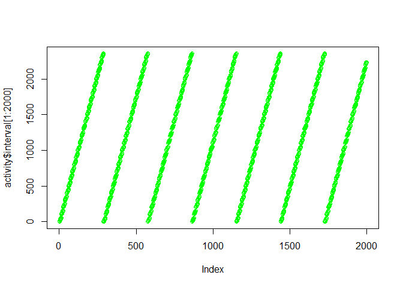
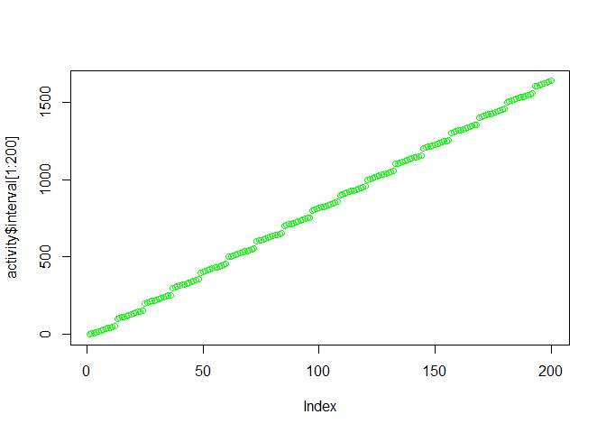
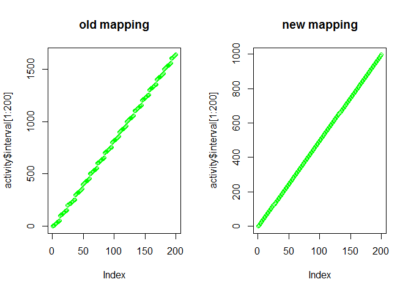
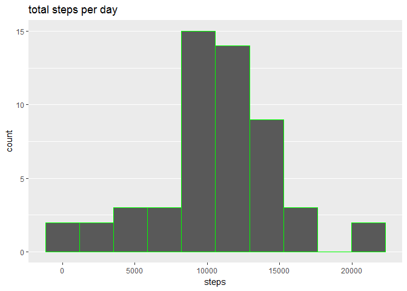
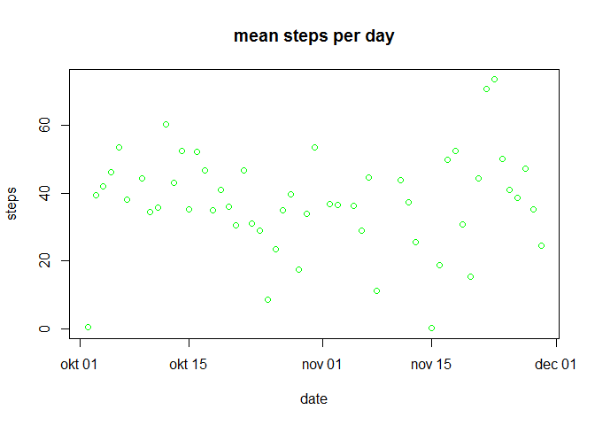
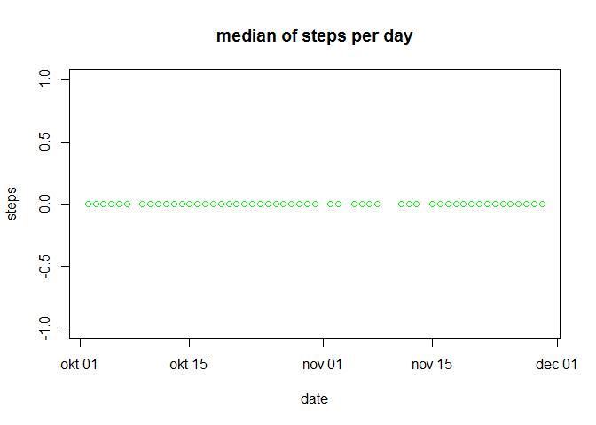
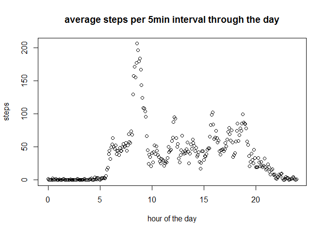
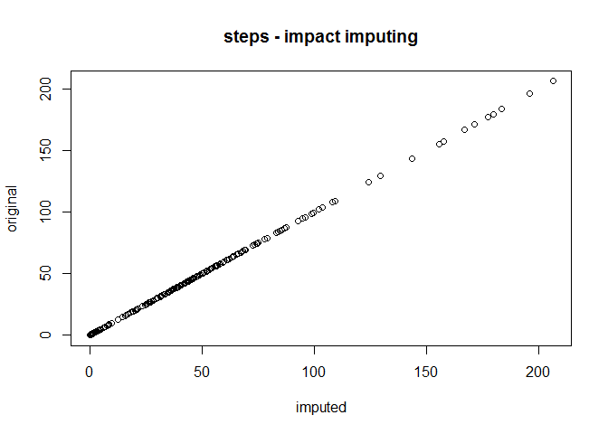
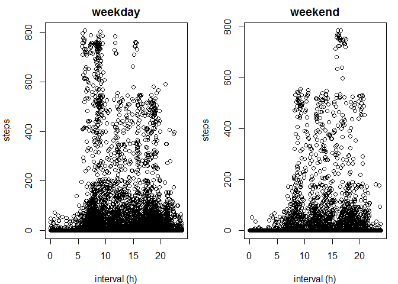

## Loading and preprocessing the data

The variables included in this dataset are:  
  - steps: Number of steps taking in a 5-minute interval (missing values are coded as NA)    
  - date: The date on which the measurement was taken in YYYY-MM-DD format     
  - interval: Identifier for the 5-minute interval in which measurement was taken    

First I load data from the csv file and I get some basic stats  


```r
  activity <- read.csv("activity.csv")
  summary(activity)
```

```
##      steps                date          interval     
##  Min.   :  0.00   2012-10-01:  288   Min.   :   0.0  
##  1st Qu.:  0.00   2012-10-02:  288   1st Qu.: 588.8  
##  Median :  0.00   2012-10-03:  288   Median :1177.5  
##  Mean   : 37.38   2012-10-04:  288   Mean   :1177.5  
##  3rd Qu.: 12.00   2012-10-05:  288   3rd Qu.:1766.2  
##  Max.   :806.00   2012-10-06:  288   Max.   :2355.0  
##  NA's   :2304     (Other)   :15840
```

```r
  str(activity)
```

```
## 'data.frame':	17568 obs. of  3 variables:
##  $ steps   : int  NA NA NA NA NA NA NA NA NA NA ...
##  $ date    : Factor w/ 61 levels "2012-10-01","2012-10-02",..: 1 1 1 1 1 1 1 1 1 1 ...
##  $ interval: int  0 5 10 15 20 25 30 35 40 45 ...
```

Findings :   
- 2304 NA's are present  
- Dates not stored as dates, but as factor. Y-m-d  

**first exploration and cleaning dates**


```r
  class(activity$date)
```

```
## [1] "factor"
```

```r
  activity$date <- as.Date(activity$date)
  class(activity$date)
```

```
## [1] "Date"
```

**exploration of interval**

```r
plot(activity$interval[1:2000], col = "green")
```

<!-- -->
Findings :
- intervals are reset to 0 each day


```r
plot(activity$interval[1:200], col = "green")
```

<!-- -->
Findings : - intervals run illogically : the increase is taking hours into account as 5-10-15-...-50-55-100-105... 

Remapping intervals to continuos stream of minutes : ...-50-55-100-105-... is mapped to ... -50-55-60-65-... Note, this remapping only can run once, when running this part of the script again, it needs to start with reloading the data!

```r
par(mfrow = c(1,2))
plot(activity$interval[1:200], main = "old mapping", col = "green")
activity$interval <- (floor((activity$interval)/100)*60+activity$interval-floor((activity$interval)/100)*100)
plot(activity$interval[1:200], main = "new mapping", col = "green")
```

<!-- -->

## What is mean total number of steps taken per day?

I use aggregate as an easy way to calculate a metric for each value of "date".
I do this for sum, mean and median.Median does not have default na.rm = TRUE!


```r
sum_Steps_day <- aggregate(steps ~ date, activity, sum, na.rm = TRUE)

#not able to find how to do this in plot, so using ggplot
library(ggplot2)
```

```
## Warning: package 'ggplot2' was built under R version 3.4.2
```

```r
ggplot(data = sum_Steps_day, aes(steps)) + 
  geom_histogram(bins = 10, col = "green") +
  ggtitle("total steps per day") +
  theme(panel.grid.major.x = element_blank(), panel.grid.minor.x = element_blank())
```

<!-- -->

```r
mean_Steps_day <- aggregate(steps ~ date, activity, mean, na.rm = TRUE)
plot(mean_Steps_day, col = "green", ylab = "steps", main = "mean steps per day")
```

<!-- -->

```r
median_Steps_day <- aggregate(steps ~ date, activity, median, na.rm = TRUE)
plot(median_Steps_day, col = "green", ylab = "steps", main = "median of steps per day")
```

<!-- -->

## What is the average daily activity pattern?

step 1 : grouping per interval across days
step 2 : plot, where interval is set to hours for easy interpretation


```r
mean_Steps_interval <- aggregate(. ~ interval, activity, mean)

plot(mean_Steps_interval$interval/60,mean_Steps_interval$steps, ylab = "steps", xlab = "hour of the day", main = "average steps per 5min interval through the day" )
```

<!-- -->


## Imputing missing values

When one value is missing I, I replace with the average day profile calculated in the above section *mean_Steps_interval* for the same interval.

step 1 : copy the dataset to impute
step 2 : check which values need imputing
step 3 : for these, replace with the value of *mean_Steps_interval*

```r
activity_imputed <- activity
na_index <- which(is.na(activity_imputed$steps))
activity_imputed$steps[na_index] <- 
  mean_Steps_interval$steps[match(activity_imputed$interval[na_index], 
                                        mean_Steps_interval$interval)]


  summary(activity_imputed)
```

```
##      steps             date               interval     
##  Min.   :  0.00   Min.   :2012-10-01   Min.   :   0.0  
##  1st Qu.:  0.00   1st Qu.:2012-10-16   1st Qu.: 358.8  
##  Median :  0.00   Median :2012-10-31   Median : 717.5  
##  Mean   : 37.38   Mean   :2012-10-31   Mean   : 717.5  
##  3rd Qu.: 27.00   3rd Qu.:2012-11-15   3rd Qu.:1076.2  
##  Max.   :806.00   Max.   :2012-11-30   Max.   :1435.0
```
Before imputing we had 2304, after imputing we have no NA's are present as expected

Impact of imputing is quantified with a scatter plot of the average per interval, pre and post imputing

```r
mean_Steps_interval_imputed <- aggregate(. ~ interval, activity_imputed, mean)

plot(mean_Steps_interval_imputed$steps , mean_Steps_interval$steps, ylab = "original", xlab = "imputed", main = "steps - impact imputing" )
```

<!-- -->
No deviations from the middle line, seem to suggest imputing did not affect the aggregated.

## Are there differences in activity patterns between weekdays and weekends?

step 1 : create a reference list
step 2 : create factors when the day is  or is not in the list
I had to google the split weekday/weekend day after quite some struggling. This post from stackoverflow hed the key : (https://stackoverflow.com/questions/28893193/creating-factor-variables-weekend-and-weekday-from-date)


```r
weekdays1 <- c('maandag', 'dinsdag', 'woensdag', 'donderdag', 'vrijdag')
activity$wDay <- factor((weekdays(activity$date) %in% weekdays1), levels=c(FALSE, TRUE), labels=c('weekend', 'weekday')) 
```


step 3 : create two plots for each of the factor levels

```r
par(mfrow=c(1,2), mar = c(4,4,2,1))  #organises plots wrt each others
with(subset(activity, wDay == "weekday"), plot(interval/60, steps, main = "weekday", xlab = "interval (h)"))
with(subset(activity, wDay == "weekend"), plot(interval/60, steps, main = "weekend", xlab = "interval (h)"))
```

<!-- -->

It shows the weekends have less steps and the step peak is later.
